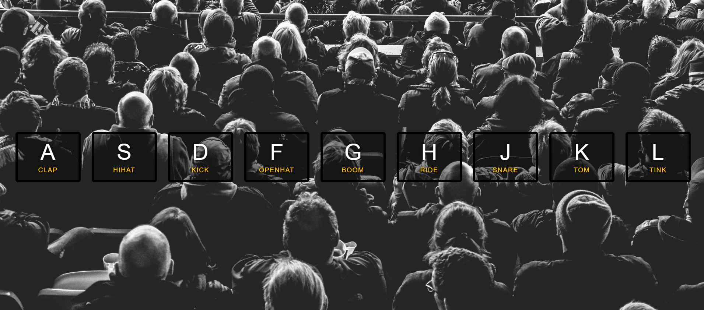

## **Day1 Note**


<div align=center></div>

---
### `本日主要內容 --`
#### 1. window.addEventListener()監聽鍵盤動作
#### 2. 利用keyCode取得對應的audio和div標籤
#### 3. 偵測所有key元件，如元件觸發特效並結束時移除
---


### `解析 --`


```js
 function playSound(e) {  
      // 傳入監聽的事件並運用物件keyCode判斷對應的audio及產生聲音及特效
      const audio = document.querySelector(`audio[data-key="${e.keyCode}"]`); // 選取audio的keyCode 
      const key = document.querySelector(`.key[data-key="${e.keyCode}"]`); /// 選取classname=key的keyCode
      if (!audio) return; // 如果audio不存在(null)則終止
      audio.currentTime = 0; // 播放進度條歸零,如此可連續敲擊,無設定則得等每次敲擊結束完才可再敲擊
      audio.play(); // 敲擊播放對應聲音
      key.classList.add('playing'); // 對應的div加入特效
    };


    function removeTransition(e) {
      // 因敲擊後特效會持續不會消失，故運用此函式來設定移除特效
      if (e.propertyName !== "transform") return; // 過濾掉除了transform以外的屬性
      this.classList.remove("playing"); // 移除敲擊時加入的特效, this指向addEventListener的元素, 或是用e.target也可以
    }

    const keys = document.querySelectorAll('.key'); // 選取所有的classname=keys的物件(在此為外層的div)
    keys.forEach(key => key.addEventListener("transitionend", removeTransition)); // 對keys裡的所有物件進行監聽，並等transition結束後再執行removeTransition function
    window.addEventListener('keydown', playSound);  // 監聽鍵盤動作，並執行playSound function


```

---

### **`補充 --`**
* keydown & keypress 差別
  * keydown: 按下鍵盤按鈕的那一瞬間取得該event的keyCode值,不區分大小寫
  * keypress: keypress是按著鍵盤按鈕的那一段時間,只對可以輸入文字的按鍵有效,並區分大小寫

* data-*
  * 用來存放與該元素有關的小型資料，可自己給屬性值，一個元素可以有多個data-*值

* querySelectorAll
  * 特別注意querySelectorAll返回的是nodeList，nodeList沒有array.prototype上的方法，轉型為Array則可使用(Array.from(nodeList variable))
  * Array.from可將一個物件或是字串轉為陣列格式

* 超方便的template literals
  * 利用反引號(`)組合字串，範圍內可利用 ${} 加入變數操作


---

### **`新增 --`**
* 2020/4/12 --
  * 新增滑鼠點擊觸發功能，並且與鍵盤觸發展現不同顏色特效(.click)
  * 因事件不同取得對應的keyCode(鍵盤type:number, 滑鼠type:string)
  * 於移除特效函式內增加滑鼠點擊事件之特效移除，以避免特效持續不消失

* 新增程式碼解析
```js
  keys.forEach(key => key.addEventListener("click", playSound)); // 新增監聽滑鼠點擊功能並傳入palySound
  
  // playSound內
  let keyType = e.keyCode || this.getAttribute('data-key'); 
  // 依據鍵盤或滑鼠事件取得對應的keyCode(兩者type不同)
  
  // 藉由兩事件取得的keyCode來進行不同的特效返還
  if (typeof keyType === "number") {  
    key.classList.add('playing'); // 如果是鍵盤事件移除playing
  } else {
    key.classList.add('click');  // 如果是滑鼠事件移除click
  }

  // removeTransition內
  this.classList.remove("playing") || this.classList.remove("click");
  // 移除鍵盤事件特效或滑鼠事件特效

```