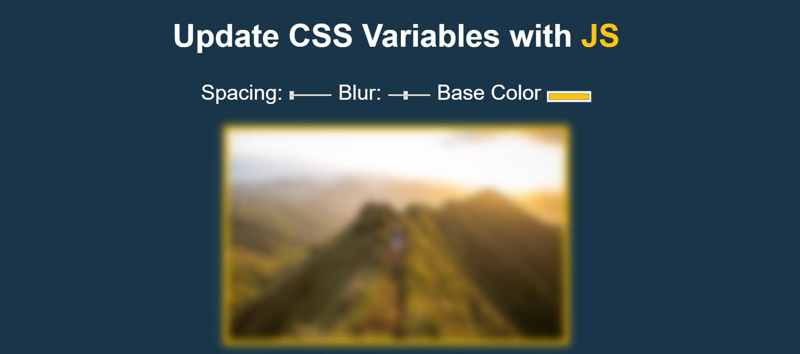

## **Day3 Note**


<div align=center></div>

---
### `本日主要內容 --`
#### 1. 利用CSS Variable定義CSS變數
#### 2. 運用監聽事件，事件發生改變即時濾鏡效果
---


### `解析 --`


```css
  :root {  
    /* 宣告 CSS 變數 */
    --base: #ffc600;  /* 控制圖片背景跟標題color */
    --spacing: 10px;  /* 控制圖片padding */
    --blur: 10px; /* 控制圖片模糊狀態 */
  }

  img {
    /* 利用 var + 變數名稱 來使用變數*/
    padding: var(--spacing);
    background: var(--base);
    filter: blur(var(--blur));
  }

  .hl {
    /* 利用 var + 變數名稱 來使用變數*/
    color: var(--base);
  }
```

---

```js
  const inputs = document.querySelectorAll('.controls input'); // 選取.controls下所有input

  function handleUpdate() {
    const suffix = this.dataset.sizing || ''; // 取出dataset中data後的名字或是空值, 空值是因為color並沒有單位
    document.documentElement.style.setProperty(`--${this.name}`, this.value + suffix); // 取得根元素修改樣式
  }

  inputs.forEach(input => input.addEventListener('change', handleUpdate)); // 監聽input的change事件並執行handleUpdate, 但此處監聽只有存取值改變時才會執行
  inputs.forEach(input => input.addEventListener('mousemove', handleUpdate)); // 監聽input的mousemove事件並執行handleUpdate, 此處監聽只要有動作就會不斷觸發函式


```

---

### **`補充 --`**
* :root
  * CSS虛擬類別中的根元素, 有點類似HTML中HTML的功能
  * CSS變數寫入內需加上"--"宣告
  * 使用變數方法 "var(--[css variable name])"

* dataset
  * 可取出對象的 data-*屬性, 等同於getAttribute

* style.setProperty() & style.cssPropertyName
  * 兩者功能相同，但style.setProperty會很方便帶參數進去(style.setProperty(propertyName, value, priority))

* addEventListener
  * 監聽指定對象，並執行觸發事件(target.addEventListener(type, listener, options))
  * [監聽事件參考](https://developer.mozilla.org/en-US/docs/Web/Events)

* filter
  * 運用實現各種濾鏡功能，可用於調整圖片、背景或邊框等等
  * [MDN](https://developer.mozilla.org/en-US/docs/Web/CSS/filter)