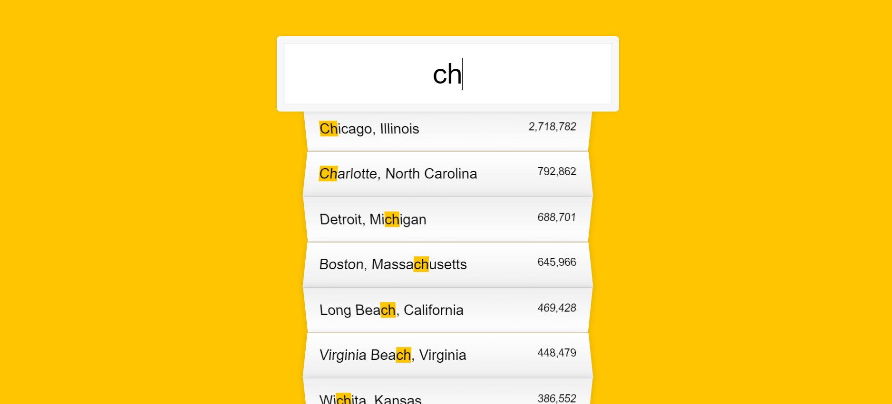

## **Day6 Note**

<div align=center></div>

---
### `本日主要內容 --`
#### 1. 利用fetch()取得json檔案資料
#### 2. 製作搜尋即時顯示功能(運用RegExp())

---


### `解析 --`

```js

    const endpoint = 'https://gist.githubusercontent.com/Miserlou/c5cd8364bf9b2420bb29/raw/2bf258763cdddd704f8ffd3ea9a3e81d25e2c6f6/cities.json';

    const cities = [];  // 空陣列儲存fetch取得之json資料

    fetch(endpoint) // 運用fetch()把json的資料抓出來
      .then(blob => blob.json()) // 第一個.then回傳的還是promis物件, 裡面是我們需要的資料使用.json轉成json檔
      .then(data => cities.push(...data)); // 到這裡資料變成物件並push進cities array內

    function findMatches(wordToMatch, cities) {
      return cities.filter(place => {
        // 使用filter()篩選搜尋cities結果匹配的城市或州
        const regex = new RegExp(wordToMatch, "gi"); // 用regex裝正則表達式的要求字串wordToMatch
        return place.city.match(regex) || place.state.match(regex);
      }); // 用match()來留下符合正則表達式要求字串之字串
    }

    function numberWithCommas(x) {
      // population呈現的方式需帶有代表千位數的逗號
      return x.toString().replace(/\B(?=(\d{3})+(?!\d))/g, ',');
    } // 將取出的population使用replace並運用正則表達式匹配出千分位位置再加入","


    function displayMatches() {
      const matchArray = findMatches(this.value, cities); // 用一變數裝findMatches篩選出之字串
      const html = matchArray.map(place => {
        // 為將match的字串highlight起來,所以對matchArray進行修改,將match的字串用<span class="hl"></span>包起來
        const regex = new RegExp(this.value, 'gi'); // 用regex裝正則表達式的要求字串this.value
        const cityName = place.city.replace(regex, `<span class="hl">${this.value}</span>`) // 將城市名稱regex替換成用span及className=hl的語句包起來
        const stateName = place.state.replace(regex, `<span class="hl">${this.value}</span>`) // 將州名稱regex替換成用span及className=hl的語句包起來
        return `
          <li>
            <span class="name">${cityName}, ${stateName}</span>
            <span class="population">${numberWithCommas(place.population)}</span>
          </li>
        `;      // 希望網頁上呈現的內容為"cityName, stateName   population",故將符合的城市及州名稱用span及戴上屬於各自的className之語句包起來
      }).join(""); // 因為map()返回的是陣列,但在這裡需要顯示出字串(HTML看不懂陣列),故使用join()將陣列重新組合成字串
      suggestions.innerHTML = html;  // 使用innerHTM將字串加入suggestions呈現在網頁上
    }

    const searchInput = document.querySelector(".search");  // 選取出className=search的物件
    const suggestions = document.querySelector(".suggestions"); // 選取出classNmae=suggestions的物件

    searchInput.addEventListener("change", displayMatches); // 監聽元素質更改時觸發進入diplayMatches
    searchInput.addEventListener("keyup", displayMatches); // 監聽按任意鍵盤按鍵時觸發進入diplayMatches


```


---

### **`補充 --`**
* fetch(url, *init)
  * fetch可以索取api內的資料，因fetch為非同步語言，所以在抓取遠端伺服器資料的同時還可繼續跑之後的程式碼，不會影響到後續作業
  * url為必備參數，會得到promise(不論成敗)，init則為選擇性，可設定回傳物件請求
  * 得到promise後可以使用.then方法來進行操作，該方法會回傳promise，並可針對promise進行需要的後續操作(例如教程中將promise轉成json檔再使用.then將資料放入陣列內)
  * [MDN--fetch()](https://developer.mozilla.org/en-US/docs/Web/API/Fetch_API)

* Regular Expressions
  * 正則表達式用來匹配字串中字元組合的模式，正則表達式也是物件，可以透過兩種方式創建，一為正則表達式(兩個斜槓(/)內放入匹配內容)，二為呼叫RegExp建構函式(new RegExp('匹配內容'))
  * 常用特殊符號: 
    * "\\" : 放在非特殊符號前面(使非特殊符號不會被逐字釋出)，代表特殊作用
    * "^" : 匹配的開頭
    * "$" : 匹配的結尾
    * "*" : 匹配前一字元零到多次
    * "+" : 匹配前一字元一到多次
    * "?" : 匹配前一字元零到一次
    * "." : 匹配除換行符號以外的單一字元
  * 正則表達式可設定全區搜索和不區分大小寫分別為g與i，可將之加入正則表達式第二個"/"後方，如使用RegExp可放在第二個參數
  * [MDN--Regular Expressions](https://developer.mozilla.org/en-US/docs/Web/JavaScript/Guide/Regular_Expressions)

* match(regexp)
  * match()為string的方法，可用來判斷字串是否符合規範的正則表達式，如符合則留下
  * [MSN--match()](https://developer.mozilla.org/en-US/docs/Web/JavaScript/Reference/Global_Objects/String/match)

* replace(pattern, replacement)
  * 會回傳一個透過將元字串與匹配內容比對並取代吻合而生成的新字串
  * pattern 可以字串或是正則表達式，replacement 可以式字串或函式

* Element.innerHTML
  * 透過innerHTML可以獲取或設置HTML元素，並可使用來添加字串

---

### **`新增功能 --`**
* 新增顯示座標(運用正則運算式取大約參考座標)
* 將搜尋結果排序後顯示
* 原搜尋結果會保留於頁面，故增加調整如搜尋條為空時，頁面搜尋結果亦為空

* 新增程式碼解析

```js

// 修改findMatches
function findMatches(wordToMatch, cities) {
  // 宣告一變數放入filter篩選出的匹配內容
  let matches = cities.filter(place => {
    const regex = new RegExp(wordToMatch, "gi");
    return place.city.match(regex) || place.state.match(regex);
  });
  
  // 如果搜尋條內容長度為0,匹配內容為空且suggestions呈現亦為空
  if (wordToMatch.length === 0) {
    matches = [];
    suggestions.innerHTML = "";
  }
  return matches;
}

// 藉由正則運算取出座標小數後六位當作參考座標
function floatWithSix(x) {
  return x.toString().replace(/([0-9]+\.[0-9]{6})[0-9]*/, "$1");
}

function displayMatches() {
    // 搜尋輸出加入座標並且座標需先進去floatWithSix中運用正則將小數點取至第六位
    return `
          <li>
            <span class="name">${cityName}, ${stateName}</span>
            <span class="population">${numberWithCommas(place.population)}</span>
            <span class="location">(${floatWithSix(place.latitude)}, ${floatWithSix(place.longitude)})</span>
          </li>
        `;
  // 運用sort()先排序搜尋結果再輸出
  }).sort().join("");

```