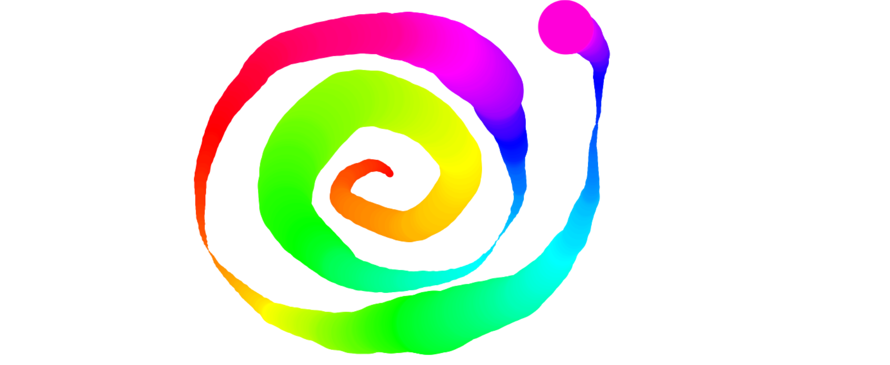

## **Day8 Note**

<div align=center></div>

---
### `本日主要內容 --`
#### 1. 運用HTML5的Canvas來製作一個畫布
#### 2. 使用滑鼠繪製出彩色且不同粗細的線條

---


### `解析 --`

```js

  const canvas = document.querySelector("#draw"); // 選取id=draw的元素
  const ctx = canvas.getContext("2d"); // 設定為2d畫布
  canvas.width = window.innerWidth;   // 設置畫布尺寸與螢幕尺寸(寬度)相符 
  canvas.height = window.innerHeight; // 設置畫布尺寸與螢幕尺寸(高度)相符
  ctx.strokeStyle = "#BADA55";  // 設定線條顏色
  ctx.lineJoin = "round";  // 線條相連接的樣式
  ctx.lineCap = "round";  // 線條結束的樣式
  ctx.lineWidth = 10;   // 線條寬度


  let isDrawing = false;  // 判斷是否正在執行畫圖(監測是否點擊滑鼠)
  let lastX = 0;  // 設置初始x位置 
  let lastY = 0;  // 設置初始y位置
  let hue = 0;  // 設定色相值(在hsl中使用)
  let direction = true;   // 判斷線條粗細增減使用

  function draw(e) {  //  開始繪製
    // 畫筆及線條設定
    if (!isDrawing) return      // 如isDrawing=false 則不觸發此function     
    ctx.beginPath(); // 開始規畫路徑
    ctx.strokeStyle = `hsl(${hue}, 100%, 50%)`; // 設定畫筆顏色(hsl值設定為變數hue)
    ctx.moveTo(lastX, lastY); // 畫筆移動到初始位置
    ctx.lineTo(e.offsetX, e.offsetY); // 將起始點到滑鼠位置用線段連接起來
    ctx.stroke(); // 繪製線條
    [lastX, lastY] = [e.offsetX, e.offsetY]; // 將結束位置設為下次起始位置

    // 顏色設定
    hue++; // 畫筆只要有移動就開始增加數字
    if (hue >= 360) {   // 運用色相值來產生彩色畫筆,並循環顏色(到達360後歸零)
      hue = 0;
    }

    // 線條粗細設定(線條寬度在1 - 100之間)
    if (ctx.lineWidth >= 100 || ctx.lineWidth <= 1) {  // 設定如線條寬度超過100或小於1時, direction設定為false
      direction = !direction;
    }
    if (direction) {  // 如果direciton = true, 線條寬度遞增
      ctx.lineWidth++;
    } else {
      ctx.lineWidth--;  // 如果direction = false, 線條寬度遞減
    }
  }

  canvas.addEventListener("mousedown", (e) => {
    isDrawing = true;
    [lastX, lastY] = [e.offsetX, e.offsetY];
  }); // 監聽按下滑鼠事件並將isDrawing改為true,且設定目前按下滑鼠的位置為畫圖初始位置


  canvas.addEventListener("mousemove", draw); // 監聽滑鼠移動事件並觸發進入draw()
  canvas.addEventListener("mouseup", () => isDrawing = false); // 監聽放開滑鼠事件並將isDrawing設回false
  canvas.addEventListener("mouseout", () => isDrawing = false); // 監聽滑鼠移出事件並將isDrawing設回false


```


---

### **`補充 --`**
* canvas
  * 為HTML元素之一，可利用此元素繪圖，亦可合成圖片或做動畫等，預設畫布大小為300px * 150px，畫布網格一單位=1px
  * 使用於繪製2D或3D矩形、文字、影像及其他基於canvan元素的物件，分別有各自的參數及方法可使用，本日教程中主要是繪製線條，故使用到定義線條樣式及線條移動方式
  * [MDN-canvas tutorial](https://developer.mozilla.org/en-US/docs/Web/API/Canvas_API/Tutorial)

* hue色相值
  * 在HSL和HSV色彩空間中，H指的就是色相，是以紅色為0度（360度）、黃色為60度、綠色為120度、青色為180度、藍色為240度、粉紅色為300度

