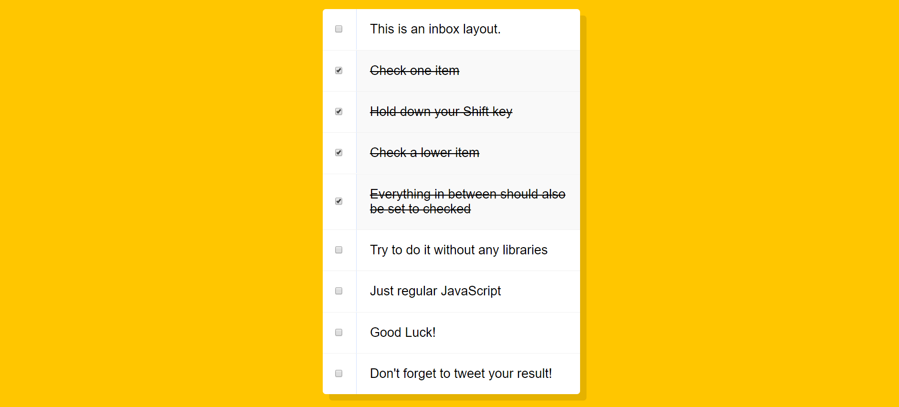

## **Day10 Note**

<div align=center></div>

---

### `本日主要內容 --`

#### 1. 使用 Shift + 滑鼠左鍵完成選取連續區間功能

---

### `解析 --`

```js
const checkboxes = document.querySelectorAll('.inbox input[type="checkbox"]'); // 選取class=inbox內所有input中的checkbox

let lastChecked; // 宣告一變數紀錄上次點擊的input

function handleCheck(e) {
  let inBetween = false;
  // 檢查是否點選shift
  if (e.shiftKey && this.checked) {
    // 如果shift被按下且按鈕有被checked
    checkboxes.forEach((checkbox) => {
      // 進入checkboxed去偵測每個input是否為最初點擊到的input(this)或是最後點擊的input(lastChecked)
      if (checkbox === this || checkbox === lastChecked) {
        // 如果checkbox等同於最初或最後點擊的input
        inBetween = !inBetween; // 點選shift的檢查變為true
      }

      if (inBetween) {
        // 如果點選shift的檢查變為true
        checkbox.checked = true; // 那麼在這區間的checkbox都變為checked狀態
      }
    });
  }
  lastChecked = this; // 紀錄這次點擊的input
}

checkboxes.forEach((checkbox) =>
  checkbox.addEventListener("click", handleCheck)
); // 監聽checkboxed內的每個check被滑鼠點擊事件並觸發進入handleCheck
```

---

### **`補充 --`**

- keyboardEvent
  - keyboardEvent 是用來記錄經由鍵盤產生的動作，其中鍵盤事件類型 keyup、keydwon、keypress 各是用來表示鍵盤執行那些動作
  - [MSN--KeyboardEvent](https://developer.mozilla.org/en-US/docs/Web/API/KeyboardEvent)

---

### **`新增功能 --`**

- 新增按鈕可選取全部並取消全部
- 修改原先的選取條件，避免直接按住 shift 點選時會發生點選以下全被選取

- 新增程式碼解析

```js

// function handleCheck 內
// 要求只有當shift按住, 最初點擊處於check狀態，還要存在最後點擊且該最後點擊也為check時才進入
if (e.shiftKey && this.checked && lastChecked && lastChecked.checked) {
    checkboxes.forEach((checkbox) => {
      if (checkbox === this || checkbox === lastChecked) {
        inBetween = !inBetween;
      }

      // 要求除了inBetween等於true而且最初和最後點擊不相等時
      if (inBetween && this !== lastChecked) {
        checkbox.checked = true;
      }
    });
  }
  lastChecked = this;
}

// 新增一個懶人按鈕, 提供點擊時實現全選, 再點擊時實現全取消
function selectAll(e) {
  checkboxes.forEach((checkbox) => {
    if (e.target.checked) {
      checkbox.checked = true;
    } else {
      checkbox.checked = false;
    }
  });
}

```
