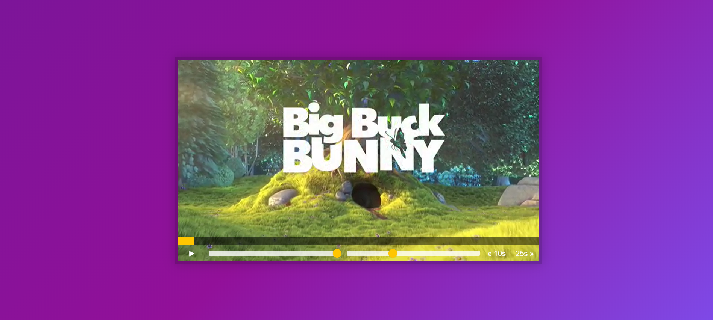

## **Day11 Note**

<div align=center></div>

---

### `本日主要內容 --`

#### 1. 建立播放器多種功能(播放、控制音量、控制影片速度、快進快退功能、顯示及操作進度條)

#### 2. 練習運用 HTMLMediaElement 來完成任務

---

### `解析 --`

```js
// 首先將video會需要使用的物件選取出來
const player = document.querySelector(".player"); // 容器
const video = player.querySelector(".viewer"); // 影片
const progress = player.querySelector(".progress"); // 進度條
const progressBar = player.querySelector(".progress__filled"); // 當前進度
const toggle = player.querySelector(".toggle"); // 播放鍵
const skipButtons = player.querySelectorAll("[data-skip]"); // skip按鈕(快進或快退)
const ranges = player.querySelectorAll(".player__slider"); // handler(控制音量或影片速度)

function togglePlay() {
  // 判斷video的播放狀態並進行播放或暫停
  const method = video.paused ? "play" : "pause"; // 宣告一變數判斷video.paused狀態為true或false
  video[method](); // 根據method設定video的播放或暫停
}

function updateButton() {
  // 根據video的播放狀態呈現播放或暫停按鈕樣式
  const icon = this.paused ? "►" : "❚ ❚"; // 宣告一變數判斷影片是播放或是暫停
  toggle.textContent = icon; // 將判斷結果放入及改變播放鍵按鈕樣式
}

function skip() {
  // 將video現在正在播放的時間加上點擊事件對應按鈕中的data-skip值(-10或25), 因dataset中值為string故須設定為數字再進行運算
  video.currentTime += parseFloat(this.dataset.skip);
}

function handleRangeUpdate() {
  // 判斷進入的handler name並附於得到的事件數值
  video[this.name] = this.value;
}

function handleProgress() {
  // 設定進度條時間可以跟著影片播放而增減, 因progressBarss(當前進度)對應的css內有設定flex-basis屬性, 故在此將時間轉換成百分比再放入對應的flex-basis
  const percent = (video.currentTime / video.duration) * 100; // (影片現在時間 / 影片總長度 ) * 100 取得現在影片時間的百分比
  progressBar.style.flexBasis = `${percent}%`; // 將百分比放入對應的flex-basis
}

function scrub(e) {
  // 將點擊事件位置之當前秒數賦予給video的當前時間
  const scrubTime = (e.offsetX / progress.offsetWidth) * video.duration; // 宣告一變數記錄當前秒數, ( 點擊事件當前所在位置 / 進度條的總寬度 ) * 影片總長度
  video.currentTime = scrubTime; // 將當前秒數賦予給當前時間, 進而使進度條移動到點擊位置
}

video.addEventListener("click", togglePlay); // 監聽點擊影片並進入togglePlay
video.addEventListener("play", updateButton); // 監聽影片播放時進入updateButton改變按鈕樣式
video.addEventListener("pause", updateButton); // 監聽影片暫停時進入updateButton改變按鈕樣式
video.addEventListener("timeupdate", handleProgress); // 當currentTime更新時進入handleProgress

toggle.addEventListener("click", togglePlay); // 監聽點擊播放按鈕時進入togglePlay
skipButtons.forEach((button) => button.addEventListener("click", skip)); // 監聽點擊到skip鍵時進入skip
ranges.forEach((range) => range.addEventListener("change", handleRangeUpdate)); // 監聽handler數值改變時進入handleRangeUpdate
ranges.forEach((range) =>
  range.addEventListener("mousemove", handleRangeUpdate)
); // 監聽滑鼠移動到handler就進入handleRangeUpdate

// 為實現藉由點選來拉動進度條, 故設定以下監聽來操控進度條
let mousedown = false; // 宣告一個變數來記錄mousedown的狀態
progress.addEventListener("click", scrub); // 監聽進度條點擊時進入scrub
progress.addEventListener("mousemove", (e) => mousedown && scrub(e)); // 監聽滑鼠在進度條上移動時,進度條隨著滑鼠移動(mousedown=true且進入scrub)
// 為達到拖曳進度條狀態,需藉由mousedown來輔助
progress.addEventListener("mousedown", () => (mousedown = true)); // 設定滑鼠點下或拿起時mousedown的狀態
progress.addEventListener("mouseup", () => (mousedown = false)); // 設定滑鼠點下或拿起時mousedown的狀態
```

---

### **`補充 --`**

- HTMLMediaElement

  - 添加支持音頻和視頻所需的屬性和方法
  - [MDN--HTMLMediaElemnt](https://developer.mozilla.org/en-US/docs/Web/API/HTMLMediaElement)

- video & audio
  - 基本上兩者差異不大，主要在於 audio 不支持 width/height 及 poster 屬性，但佔用空間比 video 小，可視需求使用

---

### **`新增 --`**

- 更改所有按鈕圖示
- 新增顯示全螢幕

```js
// 全螢幕需要注意因每個瀏覽器都有些微不同,故必須針對所有瀏覽器進行調配
function fullScreen() {
  if (video.requestFullscreen) {
    video.requestFullscreen(); // Chrome, Safari & Opera
  } else if (video.msRequestFullscreen) {
    video.mozRequestFullScreen(); // Firefox
  } else if (video.mozRequestFullScreen) {
    video.msRequestFullscreen(); // IE/Edge
  } else if (video.webkitRequestFullscreen) {
    video.webkitRequestFullscreen();
  }
}
```
