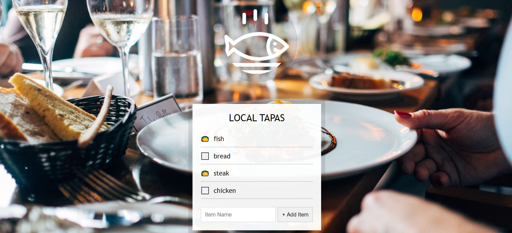

## **Day15 Note**

<div align=center></div>

---

### `本日主要內容 --`

#### 1. 顯示出新增的輸入資料

#### 2. 運用 localStorage 讓頁面重整時原先輸入的資料保留

---

### `解析 --`

```js
const addItems = document.querySelector(".add-items"); // 選取出form元素
const itemsList = document.querySelector(".plates"); // 選取出ul元素, 之後會顯示出輸入的input產生的值
const items = JSON.parse(localStorage.getItem("items")) || []; // 讀取localStorage中儲存的字串(藉由JSON轉回js物件)或宣告一個空陣列

function addItem(e) {
  // preventDefault()避免每次submit時都重整網頁
  e.preventDefault();
  // 選取出form中input中輸入的值
  const text = this.querySelector("[name=item]").value;
  // 儲存input中的值及checked狀態
  const item = {
    text, // test: test
    done: false, // checked狀態
  };

  items.push(item); // 將item物件存入先前宣告的空陣列items
  populationList(items, itemsList); // 將資料放入populationList生成元素
  localStorage.setItem("items", JSON.stringify(items)); //
  this.reset(); // 清除輸入的內容
}

function populationList(plates = [], platesList) {
  // 運用map()讓傳入的items陣列生成元素,並運用join()來將陣列組成字串顯示在頁面
  platesList.innerHTML = plates
    .map((plate, i) => {
      return `
            <li>
              <input type="checkbox" data-index=${i} id="item${i}" ${
        plate.done ? "checked" : ""
      }>
              <label for="item${i}">${plate.text}</label>
            </li>
          `;
    })
    .join("");
}

function toggleDone(e) {
  // 確認進入的是否是input,是才進行後續動作
  if (!e.target.matches("input")) return;
  // 取出input中data-index的值
  const el = e.target;
  const index = el.dataset.index;
  // checked的狀態進行切換(true/false)
  items[index].done = !items[index].done;
  // 將更新的狀態存入localStorage(運用JSON轉為字串)
  localStorage.setItem("items", JSON.stringify(items));
  // 更新陣列
  populationList(items, itemsList);
}

addItems.addEventListener("submit", addItem); // 監聽提交submit時(+ Add Item)觸發進入addItem
itemsList.addEventListener("click", toggleDone); // 監聽點擊input中的checkedbox時進入toggleDone

populationList(items, itemsList); // 重整陣列
```

---

### **`補充 --`**

- localStroage & sessionStorage

  - 兩者皆允許存取目前文件至瀏覽器中，差別在於 localStroage 的儲存資料並無到期限制，而 sessionStorage 的儲存資料會在目前瀏覽網頁關閉時同時清除
  - localStorage 內的資料皆須為字串形式，調用或存入都須特別注意轉換

* e.preventDefault()
  - 如果事件是可以取消，則取消事件的預設行為，常用於提交 submit 時，因 submit 後定會重整網頁，故可藉此取消重整網頁的預設行為，取消預設行為並不會影響到事件傳遞，仍會繼續執行後續傳遞

---

### **`新增 --`**

- 增加品項刪除按鈕
- 增加品項全選按鈕

- 新增程式碼解析

```js
const all = document.querySelector(".all"); // 選取新增的全選按鈕

// 全選按鈕功能
function selectAll(e) {
  // 將全選按鈕功能的checked狀態寫入items裡面每個項目的checked狀態,讓兩者同步
  const checkAll = e.target.checked;
  items.forEach((index) => {
    index.done = checkAll;
  });
  localStorage.setItem("items", JSON.stringify(items)); // 存檔
  populationList(items, itemsList); // 更新
}

all.addEventListener("click", selectAll); // 監聽點擊全選按鈕事件

// 新增品項刪除按鈕
function populationList(plates = [], platesList) {
  platesList.innerHTML = plates
    .map((plate, i) => {
      // 於每個輸出項目多加一項刪除按鈕
      return `
    <li>
    <input type="checkbox" data-index=${i} id="item${i}" ${
        plate.done ? "checked" : ""
      }>
    <label for="item${i}">${plate.text}</label>
    <button class="btn">delete</button>
    </li>
    `;
    })
    .join("");
}

// 於toggleDone中增加刪除條件
function toggleDone(e) {
  // 確認進入事件target必須為input或button
  if (!e.target.matches("input") && !e.target.matches("button")) return;
  // 假設一個變數用來辨別儲存狀態
  let saveData = false;
  const el = e.target;
  const index = el.dataset.index;
  if (e.target.matches("input")) {
    items[index].done = !items[index].done;
    saveData = true;
  } else if (e.target.matches("button")) {
    // 如果進入事件target是button, 運用splice刪除點選的項目
    items.splice(index, 1);
    saveData = true;
  }
  // 如進入到input及button修改時(saveData=true),儲存再更新
  if (saveData) {
    localStorage.setItem("items", JSON.stringify(items));
    populationList(items, itemsList);
  }
}
```
