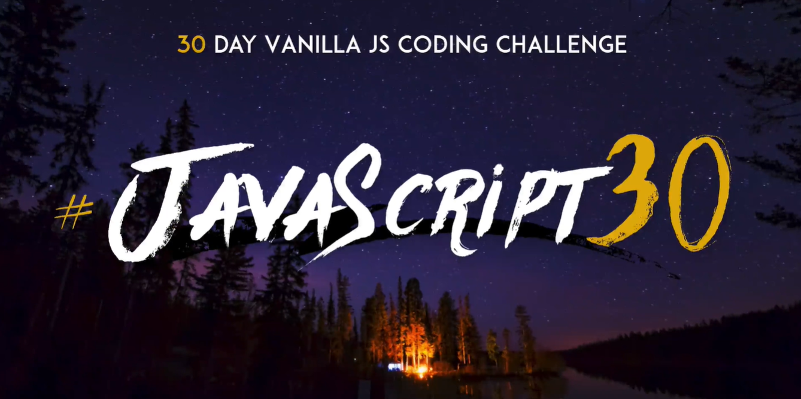

# Javascript - 30days

---

在學習的過程中常感到困惑與不安全感，這時候我會喜歡到處搜尋資料，4月初的某天睡前意外找到[Wes Bos](https://javascript30.com/)建立的30天挑戰課程後，決定開始加入課程強化自身能力，並且每日紀錄學習歷程及藉由學習內容新增內容，期盼完成後變得更強❤

---

### `每週主要任務--`

**平日** : 完成每日程式碼及前日筆記 

**假日** : 修改當週程式碼(+加平日任務)

---

| Javascript 30天   |        主題         |                 內容                    |                     新增內容                    |
|:--:|:--:|:--:|:--:|
|       DAY 1       | JavaScript Drum Kit |   按鍵盤播放出對應按鍵聲音(並產生特效)   |  滑鼠點擊觸發功能，並且與鍵盤觸發展現不同顏色特效 |
|       DAY 2       |  JS and CSS clock   |      用JS與CSS搭配製作一個實時的時鐘     | 調整指針樣式及新增顯示當日日期與時間 |
|       Day 3       |       CSS Variable     |            製造即時濾鏡效果              | 新增3種濾鏡效果並微調版面 |
|       Day 4       |    Array Cardio Day 1  |             練習Array操作               | 新增版面 |
|       Day 5       |    Flex Panel Gallery  |      點擊圖片後會動畫展開並展示效果      | 增加判斷圖片展開狀態，並進行調整 |
|       Day 6       |        Type Ahead      |   運用JS製造搜尋即時顯示功能             | 增加座標輸出，並將搜尋結果進行排序|
|       Day 7       |    Array Cardio Day 2  |            練習Array操作part2           | 新增版面 |
|       Day 8       |  Fun With HTML5 Canvas |  使用Canvas製作畫布並用滑鼠繪製彩色線條  | 創建三個按鈕設置合成效果及清除畫布 |
|       Day 9       |  Dev Tools Domination  |         練習使用Chrome開發工具          | 新增版面 |
|       Day 10      |  Hold Shift And Check Checkboxs | 使用shift+左鍵完成連續區間選取功能 ||
|       Day 11      | Custom Video Player  | 運用HTML video建立客製化撥放器功能 ||
|       Day 12      | Key Sequence Detection | 建立隱藏密碼，輸入正確取得對應特效 ||
|       Day 13      |   Slide in on Scroll  | 滾動頁面到定點時產生滑入圖片的動畫效果 ||
